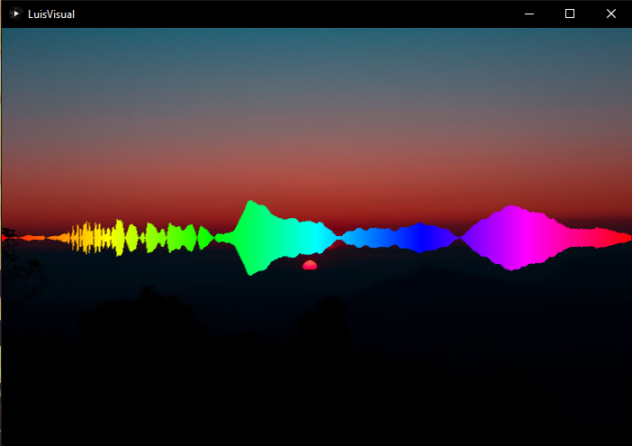
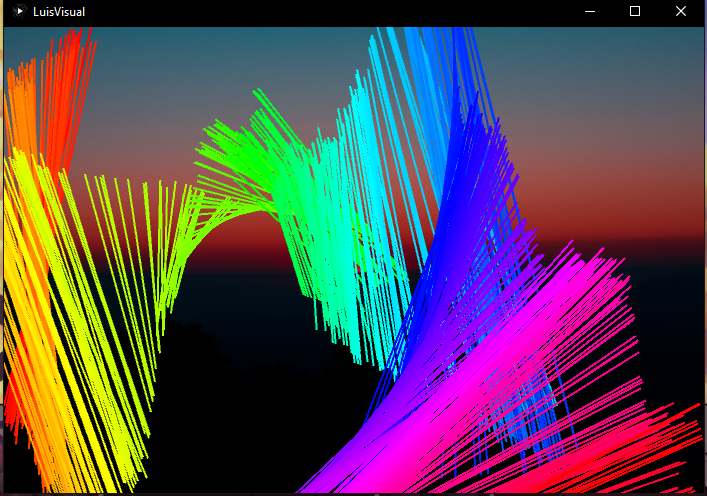
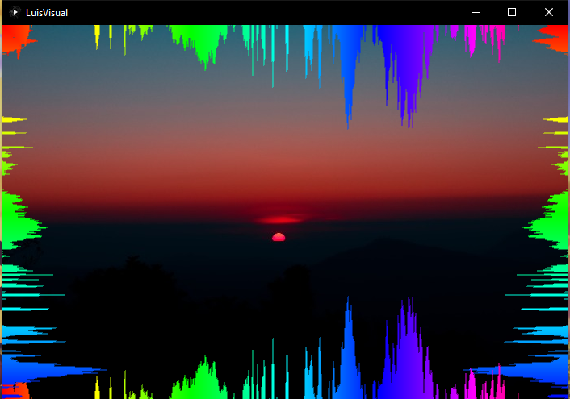
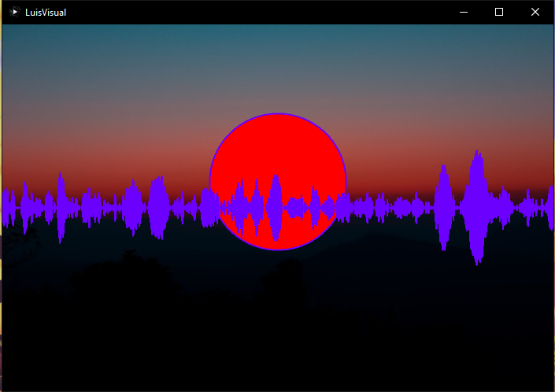
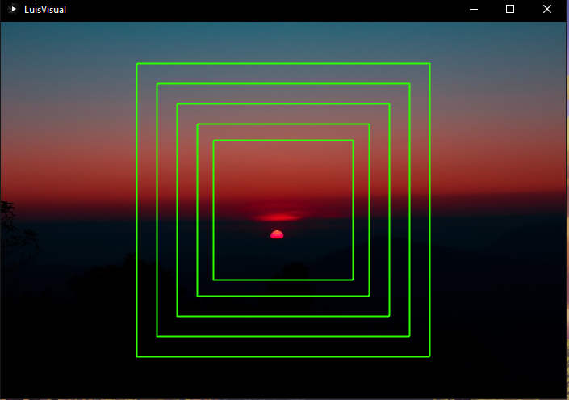
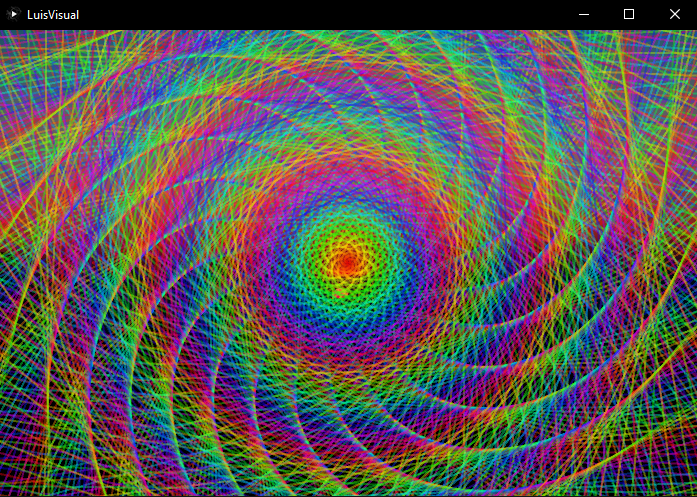
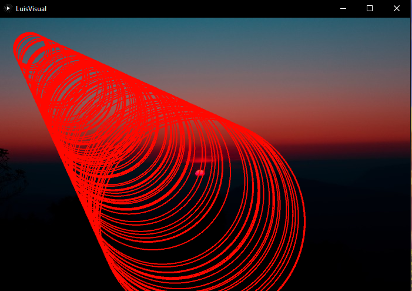

# Music Visualiser Project

Name: Luis Fernando Grand

Student Number: C19403516

## Instructions
- Fork this repository and use it a starter project for your assignment
- Create a new package named your student number and put all your code in this package.
- You should start by creating a subclass of ie.tudublin.Visual
- There is an example visualiser called MyVisual in the example package
- Check out the WaveForm and AudioBandsVisual for examples of how to call the Processing functions from other classes that are not subclasses of PApplet

# Description of the assignment
In this assignment I will showcase the use of various audio visualisation effects using Java processing libraries 

# Instructions
To run the program click the run code button.
There is a selection of 7 visuals.To change them press any key from 0-6
Enjoy the show :)

# How it works
The program is quite simple to use. Once the user executes the code a new display will open.
The mp3 file selected will start playing automatically.
The user will then be able to pick from a selection of 7 effects.
Each effect has a number key assigned to it.This is done using the switch().

# What I am most proud of in the assignment
The parts that I am most proud of in this assignment are the 4th and 5th effect that I implemented. Even though they are really simple the 4th effect with the circle and the line 
have a nice synergy that go well with the background image. Also the 5th effect with the square layers creates calm atmosphere which in my opinion is important when listning to music and it was what I was aming for to achieve in this assignment.

# Markdown Tutorial

A list of the various effects in this program:
- Line
- Hourglass
- Wallmount
- Line&Circle
- Square Layers
- All Seeing Eye
- Tunnel


This is the code for Square Layers effect which is my favourite effect out of all of the rest. 
```
public void render()
{
	float c = map(average, 0, 1, 0, 255);
                stroke(c, 255, 255);        
                strokeWeight(2);
                noFill();
                rectMode(CENTER);
                float size = 10 + (lerpedAverage * 500);
                rect(width / 2, height / 2, size, size);
                size = 50 + (lerpedAverage * 500);
                rect(width / 2, height / 2, size, size);
                size = 100 + (lerpedAverage * 500);
                rect(width / 2, height / 2, size, size);
                size = 150 + (lerpedAverage * 500);
                rect(width / 2, height / 2, size, size);
                size = 200 + (lerpedAverage * 500);
                rect(width / 2, height / 2, size, size);
}
```
These are some pictures showcaseing the different effects in the program:

The line effect




The hourglass effect


The wallmount effect


The line & circlue effect


The Sqaure Layers effect


The All Seeing Eye effect


The Tunnel effect




This is a youtube video:

[](https://www.youtube.com/watch?v=vsD3EG1qFpI)